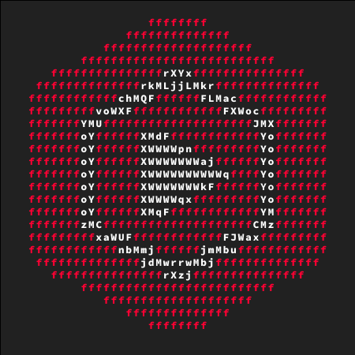

<h1 align="center">YT Studio CLI</h1>

<p align="center">
  
</p>

<p align="center">
  <a href="https://github.com/jdwit/ytstudio/actions/workflows/ci.yml"></a>
  <a href="https://pypi.org/project/ytstudio-cli/"></a>
  <a href="https://pypi.org/project/ytstudio-cli/"></a>
</p>

<p align="center">
  Manage and analyze your YouTube channel from the terminal. Designed for humans and AI agents.
</p>

> [!NOTE]
> This is **not** an official Google product, see [disclaimer](#disclaimer).

## Motivation

I built this because I needed to bulk update video titles for a YouTube channel I manage with 300+
videos. YouTube Studio does not support bulk search-replace operations, which made it a tedious
manual process. This tool uses the YouTube Data API to perform bulk operations on video metadata.
Furthermore, it provides features for analytics and comment moderation, all accessible from the
command line.

## Features

- Bulk update video metadata across hundreds of videos in one pass (search-replace titles,
  descriptions, tags).
- Upload videos from a directory using YAML sidecars for metadata and thumbnails.
- Schedule, start, stop, and update YouTube livestream broadcasts, including RTMP ingest details.
- Multi-channel profiles: manage several channels from one machine and switch per command.
- Comments moderation: list, reply, and moderate from the CLI.
- Channel analytics queries via the YouTube Analytics API.

## MCP server mode (for AI agents)

`ytstudio` ships an optional Model Context Protocol server so AI agents
(Claude Desktop, Cursor, custom clients) can manage your channel through the
same surface you use from the terminal.

Install the optional extra:

```bash
uv tool install "ytstudio-cli[mcp]"
```

Generate a ready-to-paste config block for Claude Desktop:

```bash
ytstudio mcp print-config --client claude-desktop
```

That produces something like:

```json
{
  "mcpServers": {
    "ytstudio": {
      "command": "/usr/local/bin/ytstudio",
      "args": ["mcp", "serve"]
    }
  }
}
```

Read tools are always on. Write tools are gated behind either
`--allow-write` or `YTSTUDIO_MCP_ALLOW_WRITE=1`; `--read-only` forces a
read-only server even if the env var is set.

Read-only tools:

- `whoami`, `list_videos`, `get_video`, `list_categories`
- `analytics_overview`, `analytics_query`
- `list_comments`
- `list_broadcasts`, `get_broadcast` (stream key always redacted)
- `list_playlists`, `get_playlist`, `list_playlist_items`
- `list_captions`

Write-gated tools (require `--allow-write` or `YTSTUDIO_MCP_ALLOW_WRITE=1`):

- `update_video`
- `publish_comments`, `reject_comments`
- `schedule_broadcast`, `transition_broadcast`, `update_broadcast`
- `create_playlist`, `update_playlist`, `delete_playlist`
- `add_to_playlist`, `remove_from_playlist`

See [docs/mcp.md](docs/mcp.md) for the full surface, env vars, and security
model.

## Documentation

See the [full documentation](https://jdwit.github.io/ytstudio-cli/) for installation, OAuth setup, and the command reference.

## Development

Clone the repo, sync dev dependencies, and install the pre-commit hook so
`ruff check` and `ruff format` run on every commit (same checks CI runs):

```bash
uv sync --group dev
uv run pre-commit install
```

Run the suite manually with `uv run pytest` and `uv run pre-commit run --all-files`.

To preview the docs site locally, install the `docs` group and serve with mkdocs:

```bash
uv sync --group docs
uv run mkdocs serve  # or: uv run mkdocs build
```

## API quota

The YouTube Data API enforces a default quota of 10_000 units per project per day. Most read
operations (listing videos, comments, channel info) cost 1 unit, while write operations like
updating video metadata or moderating comments cost 50 units each. Bulk updates can consume quota
quickly. When exceeded, the API returns a 403 error; quota resets at midnight Pacific Time.

You can request a quota increase via **IAM & Admin** → **Quotas** in the
[Google Cloud Console](https://console.cloud.google.com/). See the
[official quota documentation](https://developers.google.com/youtube/v3/getting-started#quota) for
full details.

## Disclaimer

This is not an officially supported Google or YouTube product. YouTube and YouTube Studio are
trademarks of Google. All channel data is accessed exclusively through the official
[YouTube Data API](https://developers.google.com/youtube/v3) and
[YouTube Analytics API](https://developers.google.com/youtube/analytics).
