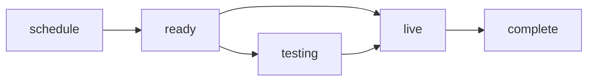

# Live broadcasts

`ytstudio livestreams` drives YouTube's `liveBroadcasts` API: schedule
broadcasts, transition them through testing/live/complete, update settings,
and surface the bound stream's RTMP ingest URLs. The actual video push to
YouTube still happens through your encoder (OBS, Streamlabs, etc.).

## Lifecycle



## Listing and showing

```bash
ytstudio livestreams list --status upcoming      # only what is scheduled
ytstudio livestreams list --status all -n 50     # everything, capped at 50
ytstudio livestreams list -o json                # machine-readable
ytstudio livestreams show <broadcast-id>         # details
ytstudio livestreams show <id> --ingest          # also the bound stream's RTMP URLs
ytstudio livestreams show <id> --show-key        # reveal the stream key
```

!!! warning "Stream keys are credentials"

    `--ingest` is safe to pipe into a script: the stream key is redacted to
    its last four characters. Only pass `--show-key` when you need the
    actual key for your encoder, and treat the printed line as a secret.

## Scheduling

`schedule` is **dry-run by default**: it prints the body it would send and
exits. Pass `--execute` to actually create the broadcast.

```bash
ytstudio livestreams schedule \
    --title "Office hours" \
    --scheduled-start 2026-06-01T19:00:00+02:00 \
    --scheduled-end   2026-06-01T20:00:00+02:00 \
    --privacy unlisted \
    --not-made-for-kids
# review the preview, then:
ytstudio livestreams schedule \
    --title "Office hours" \
    --scheduled-start 2026-06-01T19:00:00+02:00 \
    --privacy unlisted --execute
```

!!! note "Quota"

    `liveBroadcasts.insert` and `liveBroadcasts.update` cost roughly 50
    quota units each. See [API quota](api-quota.md) for context.

## Going live

The `start` command has a `--to` flag that picks the target state.

```bash
ytstudio livestreams start <id> --to testing     # monitor stream (preview)
ytstudio livestreams start <id>                  # default: --to live
ytstudio livestreams stop <id>                   # transition to complete
```

Transitions are asynchronous; the CLI prints the current status and a hint
that it may take a moment to settle.

## Updating

`update` accepts the same field flags as schedule plus the `contentDetails`
toggles. It is dry-run by default and only sends the parts that actually
changed, while preserving `contentDetails.monitorStream` (YouTube rejects
content-detail updates that omit it).

```bash
ytstudio livestreams update <id> --privacy unlisted --no-dvr
ytstudio livestreams update <id> --latency low --auto-start --execute
```

`update` does not expose the made-for-kids flag, because
`liveBroadcasts.update` only accepts `privacyStatus` under `status`. Set the
COPPA flag at schedule time.
